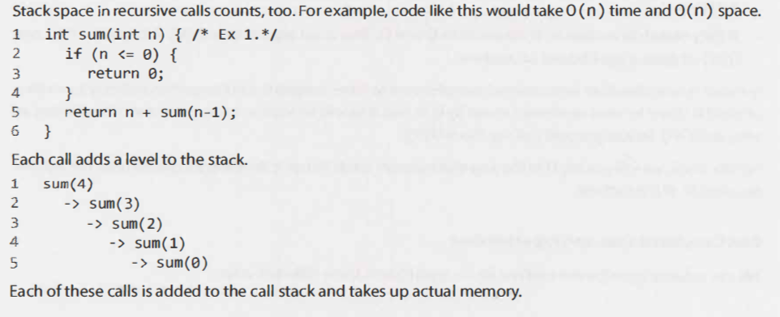
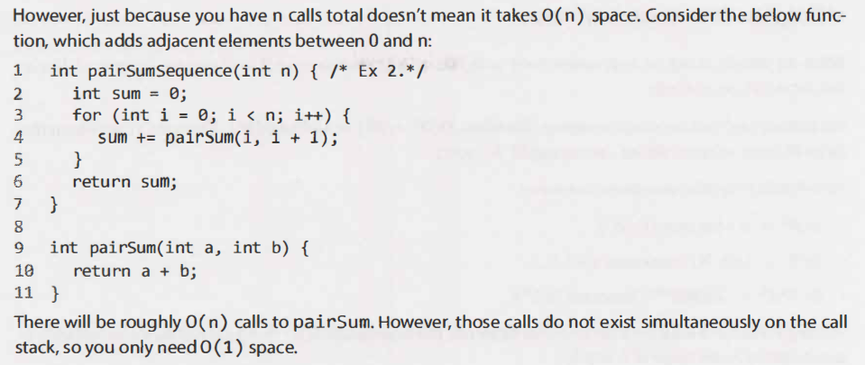
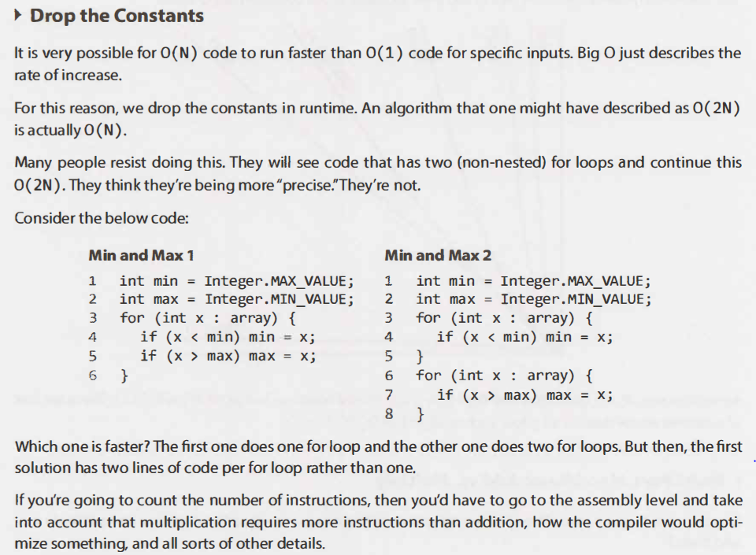
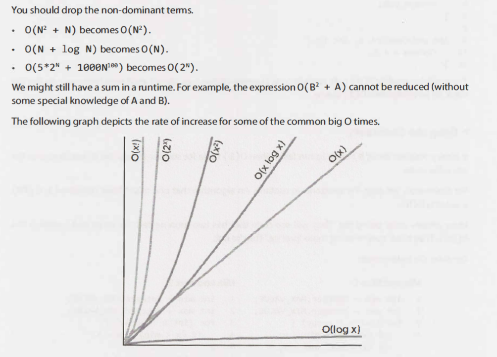
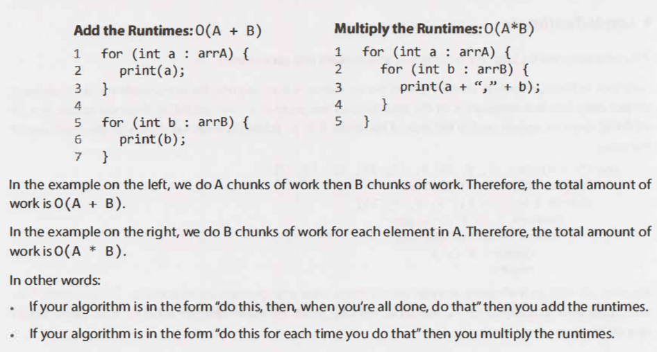
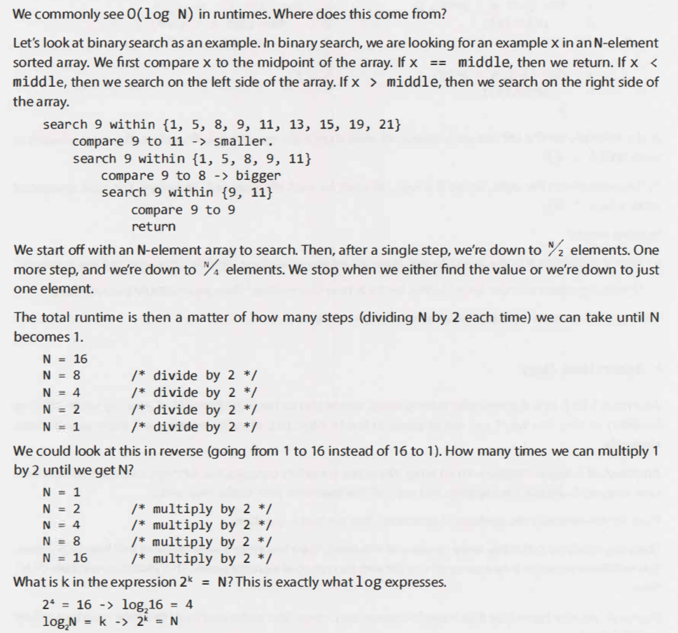

# Big O
This is short version of Big O chapter in "Cracking the Coding Interview 189 Programming Questions and Solutions" 
the language and metric we use to describe the efficiency of algorithms 

## An Analogy
via Email vs Flight? which one is faster when cost isn't an issue?

## Time Complexity

Electronic Transfer: 0(s)
- where s is the size of the file. This means that the time to transfer the file increases linearly with the size of the file

Airplane Transfer: 0(1)
- with respect to the size of the file. The time is constant.

### Big 0, Big Theta, and Big Omega
skip this part as it just confuse the people, just make sure to know that normally when we talk about Big 0, they are upper
bounds on the runtime. This is similar to a less-than-or-equal-to relationship  

### Best Case, Worst Case, and Expected Case
Rarely ever discuss best case time complexity

- Best Case: If all elements are equal, then quick sort will, on average, just traverse through the array once.
This is O ( N). 

- Worst Case: What if we get really unlucky and the pivot is repeatedly the biggest element in the array?
(Actually, this can easily happen. If the pivot is chosen to be the first element in the subarray and the
array is sorted in reverse order, we'll have this situation.) In this case, our recursion doesn't divide the
array in half and recurse on each half. It just shrinks the subarray by one element. This will degenerate
to anO(N2) runtime.

- Expected Case: Usually, for Quicksort, We can expect a runtime of O(N log N).

## Space Complexity
amount of memory or space-required by an algorithm. If we need to create an array of size n, this will
require 0( n) space. If we need a two-dimensional array of size nxn, this will require O( n2) space

### Drop the Constants

### Drop the Non-Dominant Terms

### Multi-Part Algorithms: Add vs. Multiply

### Amortized Time
The array could be full. If the array contains N elements, then inserting a new element will take O(N) time.
You will have to create a new array of size 2N and then copy N elements over. This insertion will take O ( N)
time.

However, we also know that this doesn't happen very often. The vast majority of the time insertion will be
inO(l) time.

As we insert elements, we double the capacity when the size of the array is a power of 2. So after X elements,
we double the capacity at array sizes 1, 2, 4, 8, 16, ... , X. That doubling takes, respectively, 1, 2, 4, 8, 16, 32,
64, ... , X copies.

What is the sum of 1 + 2 + 4 + 8 + 16 + ... + X? If you read this sum left to right, it starts with 1 and doubles
until it gets to X. If you read right to left, it starts with X and halves until it gets to 1.

What then is the sum of X + X + X + X + ... + 1 ?This is roughly 2X.
Therefore, X insertions take 0( 2X) time. The amortized time for each insertion is 0( 1).

### Log N Runtimes

### Recursive Runtimes

# Reference

[Time Complexity 와 Space Complexity 에 대한 이해 그리고 Code review 관점에서 다시 보기](https://hoseockchoi.wordpress.com/2019/04/05/time-complexity-%ec%99%80-space-complexity-%ec%97%90-%eb%8c%80%ed%95%9c-%ec%9d%b4%ed%95%b4-%ea%b7%b8%eb%a6%ac%ea%b3%a0-code-review-%ea%b4%80%ec%a0%90%ec%97%90%ec%84%9c-%eb%8b%a4%ec%8b%9c-%eb%b3%b4/)
