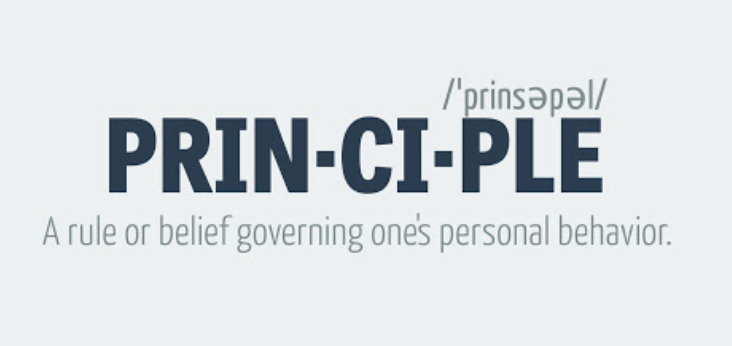
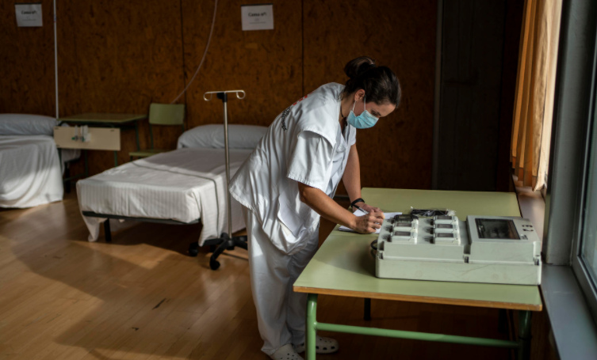
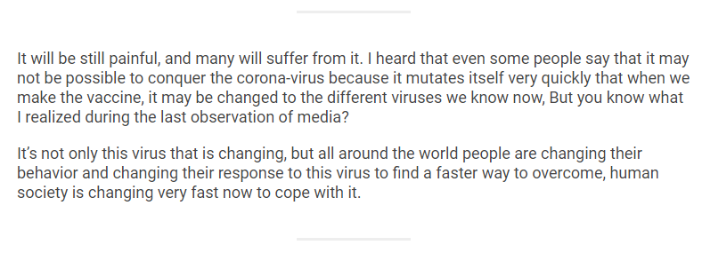
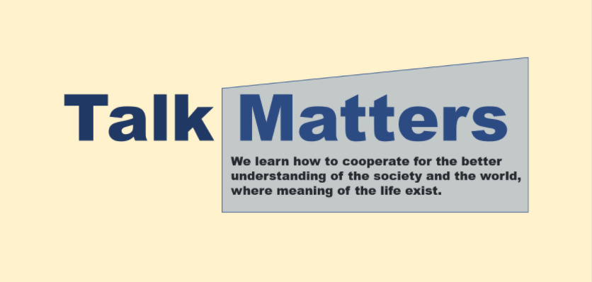
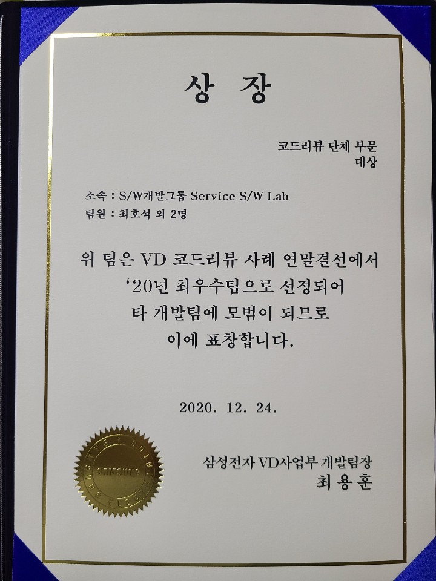

# Effective Coaching
## Title - Life with Toastmasters journey
### List your accomplishments in Toastmasters.
* 18 Speeches
  * [The Principle](https://hoseockchoi.wordpress.com/2020/04/09/the-principle/)
 

 

 

  * [The Next](https://hoseockchoi.wordpress.com/2020/03/28/the-next/)
 

  
 

  
  

  

* Area 34 Director
  * 2020 Area 34 Speech Contest
  

* [Talk Matters](https://github.com/seock04/TalkMatters)
   
  

### List your accomplishments outside of Toastmasters.
* Visual display Division Code Review Committee
  * Catchphrase & Ground Rule campaign 
* 2020 Code Review Best Practice Team Award
    

### Reflect on how much you have learned and gained.
> Reflect on your knowledge, expertise, and confidence when you started your most recent path and compare that to now.
* Conference phobia ?
* Afraid of Public Speech ?
  * At work
  * Other Toastmasters Club & District Meeting 
  * Online Meeting
* Working with Smart People
  * Explain Goal
  * Build Trust
    * Talk to them Authentically
    * Have Faith on them
    * Show your Support

### Describe the impact of being a Toastmaster.
* Establish Good habit of self learning cycle with people
* Build good community where I want to live in
* How to be supportive and positive
* Having Good Mentors

### Think about your next steps.
* Find a purpose of my life
  * code review, leadership, SW R&D cooperate culture
  * Lead international none profit organization
* Continue to establish good habit for personal growth
* Do not stop pursuing the purpose 

### Set new Toastmasters goals.
* Distinguished Toastmasters
* Become REAL Leader for the friends and colleague

## Next Pathway?
### Visionary Communication
> The Visionary Communication path is designed to help you build your skills as a strategic communicator and leader. The projects on this path focus on developing your skills for sharing information with a group, planning communications, and creating innovative solutions. Speech writing and speech delivery are emphasized in each project. This path culminates in the development and launch of a long-term personal or professional vision.

